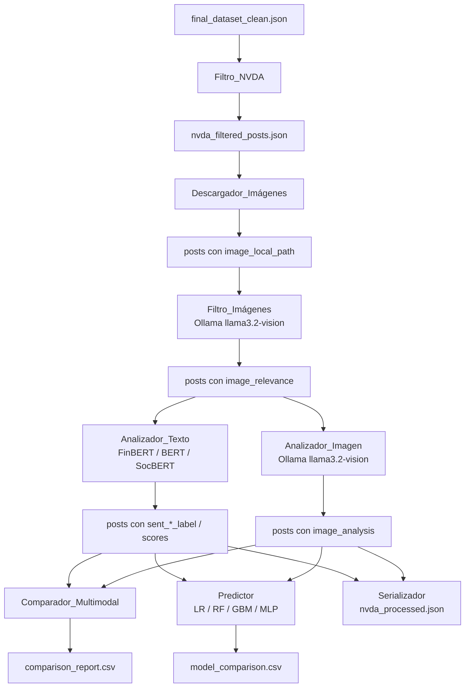

# Documento de Diseño Técnico
# nvidia-sentiment-prediction

## Visión General

El sistema es un pipeline de análisis de sentimiento multimodal orientado a NVIDIA (NVDA) que procesa posts históricos de Reddit (2023–2025) para predecir el movimiento de sentimiento a 1 día vista. El pipeline integra:

- Filtrado de posts relevantes para NVDA desde `final_dataset_clean.json`
- Descarga y filtrado de imágenes asociadas a los posts
- Análisis de sentimiento de texto con tres modelos NLP (FinBERT, BERT general, SocBERT)
- Análisis de sentimiento visual con Ollama (`llama3.2-vision`)
- Comparación multimodal (texto vs. texto + imagen)
- Entrenamiento y evaluación de modelos de clasificación para predicción a 1 día vista
- Serialización/deserialización del dataset procesado

El sistema se ejecuta como un script CLI con soporte para `--test_mode` que limita el procesamiento a un subconjunto reducido de posts.

---

## Arquitectura

El pipeline sigue una arquitectura secuencial por fases, donde cada módulo produce artefactos que consume el siguiente. Los módulos son independientes y pueden ejecutarse de forma aislada.



### Modo de Prueba

Cuando `--test_mode` está activo, cada módulo opera sobre un subconjunto de los N posts más recientes (por defecto N=200). El flujo es idéntico al completo.

---

## Componentes e Interfaces

### 1. Filtro_NVDA (`nvda_filter.py`)

**Responsabilidad**: Leer `final_dataset_clean.json` y producir `nvda_filtered_posts.json` con los posts que mencionan NVIDIA.

**Interfaz CLI**:
```
python nvda_filter.py \
  --input RedditScrapper/Data/final_dataset_clean.json \
  --output RedditScrapper/Data/nvda_filtered_posts.json \
  [--test_mode] [--sample_size 200]
```

**Función principal**:
```python
def filter_nvda_posts(posts: list[dict]) -> list[dict]:
    """
    Filtra posts que contengan términos NVDA en title o selftext.
    Términos: nvidia, nvda, $nvda, geforce, rtx, cuda (case-insensitive).
    Campos ausentes se tratan como cadena vacía.
    """
```

**Salida**: lista de posts con todos los campos originales preservados.

---

### 2. Descargador_Imágenes (`image_downloader.py`)

**Responsabilidad**: Descargar la primera imagen disponible de cada post filtrado.

**Interfaz CLI**:
```
python image_downloader.py \
  --input RedditScrapper/Data/nvda_filtered_posts.json \
  --images_dir RedditScrapper/Data/images/ \
  [--timeout 30] [--test_mode] [--sample_size 100]
```

**Función principal**:
```python
def download_post_image(post: dict, images_dir: Path, timeout: int = 30) -> dict:
    """
    Descarga la primera URL de image_urls del post.
    Actualiza image_local_path e image_download_status.
    Retorna el post actualizado.
    """
```

**Campos añadidos al post**:
- `image_local_path`: ruta relativa al archivo descargado (o `""` si no hay imagen)
- `image_download_status`: `"ok"` | `"failed"` | `"no_image"`

---

### 3. Filtro_Imágenes (`image_filter.py`)

**Responsabilidad**: Evaluar la relevancia de cada imagen usando Ollama y marcar `image_relevance`.

**Interfaz CLI**:
```
python image_filter.py \
  --input RedditScrapper/Data/nvda_filtered_posts.json \
  --output RedditScrapper/Data/nvda_filtered_posts.json \
  [--ollama_model llama3.2-vision] [--test_mode]
```

**Función principal**:
```python
def evaluate_image_relevance(post: dict, ollama_model: str = "llama3.2-vision") -> dict:
    """
    Envía la imagen a Ollama. Si score==0 y analisis indica no relevancia,
    marca image_relevance=False. En caso de error, marca image_relevance=False.
    """
```

**Campos añadidos al post**:
- `image_relevance`: `true` | `false`

---

### 4. Analizador_Texto (`text_analyzer.py`)

**Responsabilidad**: Aplicar FinBERT, BERT general y SocBERT al texto de cada post.

**Interfaz CLI**:
```
python text_analyzer.py \
  --input RedditScrapper/Data/nvda_filtered_posts.json \
  --output RedditScrapper/Data/nvda_analyzed_text.json \
  [--models finbert bert socbert] [--max_length 256] \
  [--test_mode] [--sample_size 200]
```

**Función principal**:
```python
def analyze_text_sentiment(post: dict, models: list[str], max_length: int = 256) -> dict:
    """
    Concatena title + selftext, trunca a max_length tokens.
    Para texto vacío asigna etiqueta neutral con scores por defecto.
    Añade columnas sent_{model}_label, sent_{model}_pos, sent_{model}_neg, sent_{model}_neu.
    """
```

**Campos añadidos por modelo** (ejemplo para FinBERT):
- `sent_finbert_label`: `"positive"` | `"negative"` | `"neutral"`
- `sent_finbert_pos`, `sent_finbert_neg`, `sent_finbert_neu`: probabilidades

---

### 5. Analizador_Imagen (`image_analyzer.py`)

**Responsabilidad**: Analizar el impacto de imágenes relevantes usando Ollama.

**Interfaz CLI**:
```
python image_analyzer.py \
  --input RedditScrapper/Data/nvda_analyzed_text.json \
  --output RedditScrapper/Data/nvda_analyzed_full.json \
  [--ollama_model llama3.2-vision] [--test_mode] [--sample_size 50]
```

**Función principal**:
```python
def analyze_image_sentiment(post: dict, ollama_model: str = "llama3.2-vision") -> dict:
    """
    Solo procesa posts con image_relevance=True e image_local_path válido.
    Parsea JSON de Ollama extrayendo score y analisis.
    Fallback: regex para extraer JSON; si falla, score=0.0, error=True.
    """
```

**Campo añadido al post**:
- `image_analysis`: `{"score": float, "analisis": str, "error": bool}`

---

### 6. Comparador_Multimodal (`multimodal_comparator.py`)

**Responsabilidad**: Fusionar señales de texto e imagen y comparar accuracy.

**Interfaz CLI**:
```
python multimodal_comparator.py \
  --input RedditScrapper/Data/nvda_analyzed_full.json \
  --price_data RedditScrapper/Data/nvda_top3_backfill.csv \
  --output RedditScrapper/Data/comparison_report.csv \
  [--text_weight 0.75] [--image_weight 0.25]
```

**Función principal**:
```python
def fuse_sentiment(post: dict, text_weight: float = 0.75, image_weight: float = 0.25) -> dict:
    """
    Calcula sent_text_only y sent_multimodal.
    Si no hay imagen relevante, sent_multimodal == sent_text_only.
    """
```

**Columnas del CSV de salida**:
`post_id`, `date`, `sent_text_only`, `sent_multimodal`, `price_movement_next_day`, `correct_text`, `correct_multimodal`

---

### 7. Predictor (`predictor.py`)

**Responsabilidad**: Entrenar y evaluar modelos de clasificación para predicción a 1 día vista.

**Interfaz CLI**:
```
python predictor.py \
  --input RedditScrapper/Data/nvda_analyzed_full.json \
  --price_data RedditScrapper/Data/nvda_top3_backfill.csv \
  --output RedditScrapper/Data/model_comparison.csv \
  [--test_size 0.2]
```

**Modelos entrenados**: Regresión Logística, Random Forest, Gradient Boosting (XGBoost/LightGBM), MLP.

**Función principal**:
```python
def train_and_evaluate(X_train, y_train, X_test, y_test) -> dict[str, dict]:
    """
    Entrena cada modelo y retorna métricas: accuracy, precision, recall, f1.
    División temporal (sin shuffle) para evitar data leakage.
    Desempate por F1 cuando accuracy es igual.
    """
```

---

### 8. Serializador (`serializer.py`)

**Responsabilidad**: Guardar y cargar el dataset procesado en JSON UTF-8.

**Interfaz**:
```python
def save_dataset(posts: list[dict], path: Path) -> None: ...
def load_dataset(path: Path) -> list[dict]: ...
```

---

### 9. Pipeline Principal (`pipeline.py`)

**Responsabilidad**: Orquestar todos los módulos en secuencia.

**Interfaz CLI**:
```
python pipeline.py \
  --input RedditScrapper/Data/final_dataset_clean.json \
  [--test_mode] [--sample_size 200] \
  [--text_weight 0.75] [--image_weight 0.25] \
  [--skip_download] [--skip_image_analysis]
```

---

## Modelos de Datos

### Post (objeto base)

```python
@dataclass
class Post:
    # Campos originales del dataset
    id: str
    title: str                    # "" si ausente
    selftext: str                 # "" si ausente
    created_utc: int
    date: str                     # ISO 8601
    subreddit: str
    image_urls: list[str]         # URLs de imágenes del post

    # Añadidos por Descargador_Imágenes
    image_local_path: str         # ruta relativa o ""
    image_download_status: str    # "ok" | "failed" | "no_image"

    # Añadidos por Filtro_Imágenes
    image_relevance: bool

    # Añadidos por Analizador_Texto (por cada modelo)
    sent_finbert_label: str       # "positive" | "negative" | "neutral"
    sent_finbert_pos: float
    sent_finbert_neg: float
    sent_finbert_neu: float
    sent_bert_label: str
    sent_bert_pos: float
    sent_bert_neg: float
    sent_socbert_label: str
    sent_socbert_pos: float
    sent_socbert_neg: float

    # Añadidos por Analizador_Imagen
    image_analysis: ImageAnalysis | None

    # Añadidos por Comparador_Multimodal
    sent_text_only: str           # "positive" | "negative" | "neutral"
    sent_multimodal: str
```

### ImageAnalysis

```python
@dataclass
class ImageAnalysis:
    score: float      # >0 alcista, <0 bajista, 0 neutro
    analisis: str     # explicación textual
    error: bool       # True si Ollama falló o JSON inválido
```

### ModelMetrics

```python
@dataclass
class ModelMetrics:
    model_name: str
    accuracy: float
    precision: float
    recall: float
    f1: float
```

### ComparisonRow (fila del CSV de comparación)

```python
@dataclass
class ComparisonRow:
    post_id: str
    date: str
    sent_text_only: str
    sent_multimodal: str
    price_movement_next_day: int   # 1 sube, 0 baja/mantiene
    correct_text: bool
    correct_multimodal: bool
```

### Estructura de archivos generados

```
RedditScrapper/Data/
├── final_dataset_clean.json          # entrada (existente)
├── nvda_filtered_posts.json          # salida Filtro_NVDA
├── nvda_analyzed_text.json           # salida Analizador_Texto
├── nvda_analyzed_full.json           # salida Analizador_Imagen
├── nvda_processed.json               # salida Serializador
├── comparison_report.csv             # salida Comparador_Multimodal
├── model_comparison.csv              # salida Predictor
└── images/
    └── {post_id}.{ext}               # imágenes descargadas
```

---

## Propiedades de Corrección

*Una propiedad es una característica o comportamiento que debe mantenerse verdadero en todas las ejecuciones válidas del sistema; es decir, una declaración formal sobre lo que el sistema debe hacer. Las propiedades sirven como puente entre las especificaciones legibles por humanos y las garantías de corrección verificables automáticamente.*

---

### Propiedad 1: Corrección del filtro NVDA

*Para cualquier* lista de posts (incluyendo posts con campos `title` o `selftext` ausentes), el resultado del filtro debe contener exactamente los posts que tienen al menos uno de los términos `["nvidia", "nvda", "$nvda", "geforce", "rtx", "cuda"]` en `title` o `selftext`, sin distinción de mayúsculas/minúsculas. Los campos ausentes se tratan como cadena vacía.

**Valida: Requisitos 1.1, 1.2**

---

### Propiedad 2: Preservación de campos en el filtro

*Para cualquier* post que pase el filtro NVDA, todos los campos presentes en el post original deben estar presentes con los mismos valores en el post filtrado.

**Valida: Requisito 1.3**

---

### Propiedad 3: Descarga de imagen con nombre correcto

*Para cualquier* post con `image_urls` no vacío, tras la descarga exitosa el campo `image_local_path` debe apuntar a un archivo cuyo nombre sea `{post.id}.{ext}` donde `ext` es la extensión de la primera URL, y `image_download_status` debe ser `"ok"`.

**Valida: Requisitos 2.1, 2.2**

---

### Propiedad 4: Límite de posts en modo prueba

*Para cualquier* ejecución con `--test_mode` activo y límite N, el número de posts procesados por cada módulo (Descargador_Imágenes, Analizador_Texto, Analizador_Imagen) no debe superar N.

**Valida: Requisitos 2.5, 4.5, 5.5**

---

### Propiedad 5: GIFs siempre marcados como no relevantes

*Para cualquier* post cuya URL de imagen o extensión de archivo sea `.gif`, el campo `image_relevance` debe ser `false` sin necesidad de consultar a Ollama.

**Valida: Requisito 3.1**

---

### Propiedad 6: Posts no relevantes excluidos del análisis de imagen

*Para cualquier* lista de posts, el Analizador_Imagen solo debe procesar posts con `image_relevance == true` e `image_local_path` no vacío. Ningún post con `image_relevance == false` debe tener un campo `image_analysis` generado por el analizador.

**Valida: Requisito 3.5**

---

### Propiedad 7: Completitud de campos de sentimiento de texto

*Para cualquier* post procesado por el Analizador_Texto, el resultado debe contener los campos `sent_{model}_label`, `sent_{model}_pos`, `sent_{model}_neg` (y `sent_finbert_neu`) para cada uno de los tres modelos configurados. Para posts con texto vacío, la etiqueta debe ser `"neutral"` con los scores por defecto especificados.

**Valida: Requisitos 4.1, 4.3**

---

### Propiedad 8: Completitud de image_analysis para posts con imagen relevante

*Para cualquier* post con `image_relevance == true` e `image_local_path` válido, tras el análisis el campo `image_analysis` debe existir y contener los subcampos `score` (float), `analisis` (str) y `error` (bool). Si Ollama falla o devuelve JSON inválido, `score` debe ser `0.0` y `error` debe ser `true`.

**Valida: Requisitos 5.1, 5.3**

---

### Propiedad 9: Fusión aritmética correcta texto + imagen

*Para cualquier* post con `image_relevance == true`, la señal fusionada `sent_multimodal` debe derivarse de la combinación lineal `w_text * score_text + w_image * score_image` donde `w_text + w_image == 1.0`. La etiqueta final debe corresponder al argmax de las probabilidades fusionadas.

**Valida: Requisito 6.1**

---

### Propiedad 10: Sin imagen relevante implica señales iguales

*Para cualquier* post con `image_relevance == false` o sin imagen, los campos `sent_text_only` y `sent_multimodal` deben ser iguales.

**Valida: Requisito 6.3**

---

### Propiedad 11: Selección de N posts más recientes en modo prueba

*Para cualquier* dataset filtrado de NVDA con más de N posts, cuando el modo prueba está activo con límite N, los posts seleccionados deben ser exactamente los N posts con mayor valor de `created_utc`.

**Valida: Requisito 7.2**

---

### Propiedad 12: Etiquetado correcto del movimiento de precio

*Para cualquier* par de precios de cierre `(precio_hoy, precio_mañana)`, la función de etiquetado debe devolver `1` si `precio_mañana > precio_hoy` y `0` en caso contrario (incluyendo precios iguales).

**Valida: Requisito 8.3**

---

### Propiedad 13: División temporal sin data leakage

*Para cualquier* dataset con orden temporal, tras la división 80/20, todos los ejemplos del conjunto de prueba deben tener `created_utc` estrictamente mayor que todos los ejemplos del conjunto de entrenamiento.

**Valida: Requisito 8.4**

---

### Propiedad 14: Round-trip de serialización JSON

*Para cualquier* lista de posts procesados válida, serializar a JSON y luego deserializar debe producir una lista con los mismos posts, los mismos campos y los mismos valores que la lista original.

**Valida: Requisitos 9.1, 9.3**

---

## Manejo de Errores

| Situación | Módulo | Comportamiento |
|---|---|---|
| Post sin `title` o `selftext` | Filtro_NVDA | Tratar campo como `""` |
| Dataset filtrado vacío | Filtro_NVDA | Log de advertencia, continuar |
| Error de red / timeout en descarga | Descargador_Imágenes | Log de error, `image_download_status="failed"`, continuar |
| Ollama no puede procesar imagen | Filtro_Imágenes / Analizador_Imagen | `image_relevance=false` / `error=true, score=0.0`, log de error |
| Respuesta Ollama sin JSON válido | Analizador_Imagen | Intentar regex; si falla, `score=0.0, error=true` |
| Texto vacío tras limpieza | Analizador_Texto | Etiqueta `"neutral"`, scores por defecto |
| Error en cualquier fase (modo prueba) | Pipeline | Detener fase, log con contexto, continuar siguiente fase |
| Archivo de dataset no existe o corrupto | Serializador | Log de error, ofrecer reprocesar desde dataset original |
| Dos modelos con mismo Accuracy | Predictor | Desempatar por F1-score |

### Estrategia de Logging

Todos los módulos usan el módulo estándar `logging` de Python con nivel configurable. Los errores incluyen: módulo, post_id (cuando aplica), tipo de error y mensaje descriptivo.

```python
import logging
logger = logging.getLogger(__name__)
logger.error(f"[{module}] post_id={post_id}: {error_type} - {message}")
```

---

## Estrategia de Testing

### Enfoque Dual

El sistema usa dos tipos de tests complementarios:

- **Tests unitarios**: verifican ejemplos concretos, casos borde y condiciones de error
- **Tests de propiedades**: verifican propiedades universales sobre rangos amplios de entradas generadas aleatoriamente

Ambos son necesarios: los tests unitarios detectan bugs concretos, los tests de propiedades verifican la corrección general.

### Tests Unitarios

Se enfocan en:
- Ejemplos concretos de filtrado (post con "NVDA" en título, post sin términos NVDA)
- Casos borde: post sin `title`, texto vacío, URL de GIF, respuesta Ollama malformada
- Integración entre módulos: salida de Filtro_NVDA como entrada de Descargador_Imágenes
- Verificación de columnas en CSVs de salida
- Desempate por F1 cuando accuracy es igual

### Tests de Propiedades (Property-Based Testing)

**Librería**: `hypothesis` (Python)

**Configuración**: mínimo 100 iteraciones por test (`@settings(max_examples=100)`).

Cada test de propiedad referencia su propiedad de diseño con el tag:
`Feature: nvidia-sentiment-prediction, Property {N}: {texto_de_la_propiedad}`

**Generadores necesarios**:
- `st.fixed_dictionaries(...)` para generar posts con campos aleatorios
- `st.lists(...)` para generar datasets de tamaño variable
- `st.floats(min_value=0.0, max_value=1.0)` para scores de sentimiento
- `st.integers(min_value=0)` para timestamps `created_utc`
- `st.text()` para títulos y cuerpos de posts

**Mapeo Propiedad → Test**:

| Propiedad | Test | Patrón PBT |
|---|---|---|
| P1: Corrección del filtro | `test_nvda_filter_correctness` | Invariante: resultado == subconjunto que cumple predicado |
| P2: Preservación de campos | `test_nvda_filter_preserves_fields` | Invariante: campos originales presentes en filtrado |
| P3: Descarga con nombre correcto | `test_image_download_naming` | Round-trip: URL → archivo con nombre correcto |
| P4: Límite modo prueba | `test_test_mode_limit` | Invariante: len(procesados) <= N |
| P5: GIFs no relevantes | `test_gif_always_irrelevant` | Invariante: GIF → image_relevance=false |
| P6: No relevantes excluidos | `test_irrelevant_images_excluded` | Invariante: image_relevance=false → sin image_analysis |
| P7: Completitud campos texto | `test_text_sentiment_completeness` | Invariante: campos sent_* presentes para todos los modelos |
| P8: Completitud image_analysis | `test_image_analysis_completeness` | Invariante: image_analysis presente con estructura correcta |
| P9: Fusión aritmética | `test_multimodal_fusion_arithmetic` | Metamórfica: fusión == combinación lineal exacta |
| P10: Sin imagen → señales iguales | `test_no_image_equal_signals` | Invariante: sent_text_only == sent_multimodal |
| P11: N más recientes en modo prueba | `test_test_mode_selects_most_recent` | Invariante: min(selected.created_utc) >= max(excluded.created_utc) |
| P12: Etiquetado de precio | `test_price_label_correctness` | Invariante: label == (precio_mañana > precio_hoy) |
| P13: División temporal | `test_temporal_split_no_leakage` | Invariante: max(train.date) < min(test.date) |
| P14: Round-trip serialización | `test_serialization_roundtrip` | Round-trip: deserialize(serialize(x)) == x |

### Estructura de Tests

```
tests/
├── unit/
│   ├── test_nvda_filter_unit.py
│   ├── test_image_downloader_unit.py
│   ├── test_image_filter_unit.py
│   ├── test_text_analyzer_unit.py
│   ├── test_image_analyzer_unit.py
│   ├── test_multimodal_comparator_unit.py
│   ├── test_predictor_unit.py
│   └── test_serializer_unit.py
└── property/
    ├── test_nvda_filter_props.py
    ├── test_image_downloader_props.py
    ├── test_image_filter_props.py
    ├── test_text_analyzer_props.py
    ├── test_image_analyzer_props.py
    ├── test_multimodal_comparator_props.py
    ├── test_predictor_props.py
    └── test_serializer_props.py
```

**Ejemplo de test de propiedad**:

```python
from hypothesis import given, settings
from hypothesis import strategies as st

# Feature: nvidia-sentiment-prediction, Property 1: Corrección del filtro NVDA
@given(st.lists(st.fixed_dictionaries({
    "id": st.text(min_size=1),
    "title": st.one_of(st.none(), st.text()),
    "selftext": st.one_of(st.none(), st.text()),
}), min_size=0, max_size=200))
@settings(max_examples=100)
def test_nvda_filter_correctness(posts):
    result = filter_nvda_posts(posts)
    TERMS = {"nvidia", "nvda", "$nvda", "geforce", "rtx", "cuda"}
    for post in result:
        text = ((post.get("title") or "") + " " + (post.get("selftext") or "")).lower()
        assert any(term in text for term in TERMS)
    # Todos los posts que cumplen el predicado deben estar en el resultado
    expected_ids = {p["id"] for p in posts
                    if any(t in ((p.get("title") or "") + " " + (p.get("selftext") or "")).lower()
                           for t in TERMS)}
    result_ids = {p["id"] for p in result}
    assert result_ids == expected_ids
```

**Ejemplo de test de round-trip**:

```python
# Feature: nvidia-sentiment-prediction, Property 14: Round-trip de serialización JSON
@given(st.lists(st.fixed_dictionaries({
    "id": st.text(min_size=1),
    "title": st.text(),
    "sent_finbert_label": st.sampled_from(["positive", "negative", "neutral"]),
    "sent_finbert_pos": st.floats(0.0, 1.0),
}), min_size=0, max_size=50))
@settings(max_examples=100)
def test_serialization_roundtrip(posts):
    with tempfile.NamedTemporaryFile(suffix=".json", delete=False) as f:
        path = Path(f.name)
    try:
        save_dataset(posts, path)
        loaded = load_dataset(path)
        assert loaded == posts
    finally:
        path.unlink(missing_ok=True)
```
